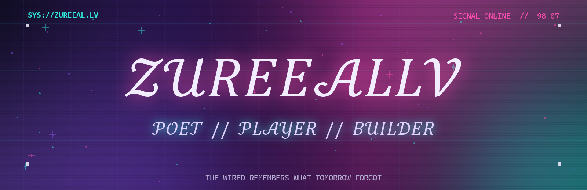
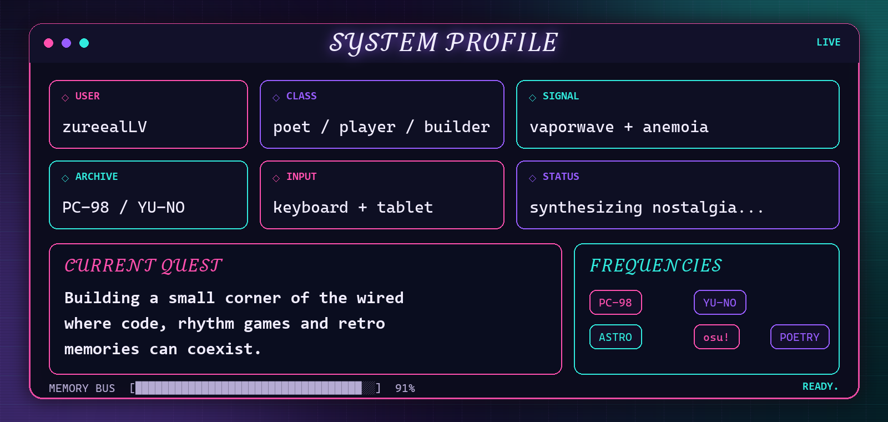

<h2 align="center">✦ 𝑺𝑪𝑶𝑹𝑬 // 𝒐𝒔𝒖!𝒔𝒕𝒂𝒏𝒅𝒂𝒓𝒅 ✦</h2>

<!-- OSU_STATS_START -->

<table>
<tr>
<td align="center" width="150">⚡ <b>PP</b> 5,367.62</td>
<td align="center" width="150">🌐 <b>Global</b> #86,698</td>
<td align="center" width="150">🇸🇬 <b>Country</b> #1,112</td>
<td align="center" width="150">🎯 <b>Accuracy</b> 96.6535%</td>
</tr>
<tr>
<td align="center" width="150">🎮 <b>Play Count</b> 21,145</td>
<td align="center" width="150">⭐ <b>Level</b> 100.21</td>
<td align="center" width="150">🔥 <b>Max Combo</b> 1,675×</td>
<td align="center" width="150">🏅 <b>SS / S / A</b> 0 / 82 / 1,125</td>
</tr>
</table>

Total score: <b>48.23B</b> · Play time: <b>411h</b> · Total hits: <b>5.32M</b> · Synced: <b>2026-07-28 UTC+8</b>

<!-- OSU_STATS_END -->

<h2 align="center">✦ 𝑳𝑶𝑨𝑫𝑶𝑼𝑻 // 𝒕𝒆𝒄𝒉 𝒔𝒕𝒂𝒄𝒌 ✦</h2>

<h2 align="center">✦ 𝑸𝑼𝑬𝑺𝑻 𝑳𝑶𝑮 // 𝒇𝒆𝒂𝒕𝒖𝒓𝒆𝒅 𝒑𝒓𝒐𝒋𝒆𝒄𝒕𝒔 ✦</h2>

<h2 align="center">✦ 𝑻𝑬𝑳𝑬𝑴𝑬𝑻𝑹𝒀 // 𝑮𝑰𝑻𝑯𝑼𝑩 ✦</h2>

<h2 align="center">✦ 𝑴𝑬𝑴𝑶𝑹𝒀 𝑬𝑨𝑻𝑬𝑹 // 𝒄𝒐𝒏𝒕𝒓𝒊𝒃𝒖𝒕𝒊𝒐𝒏 𝒔𝒏𝒂𝒌𝒆 ✦</h2>

<picture>
  <source media="(prefers-color-scheme: dark)" srcset="https://raw.githubusercontent.com/zureealLV/zureealLV/output/github-contribution-grid-snake-dark.svg">
  <source media="(prefers-color-scheme: light)" srcset="https://raw.githubusercontent.com/zureealLV/zureealLV/output/github-contribution-grid-snake.svg">
  
</picture>

 

  

<i>“感谢你的庇佑。”</i>

